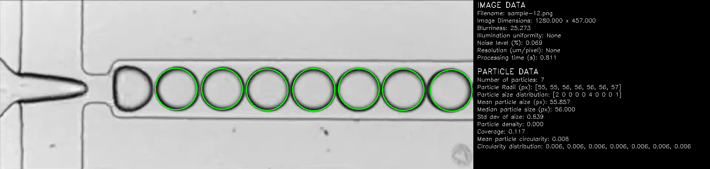
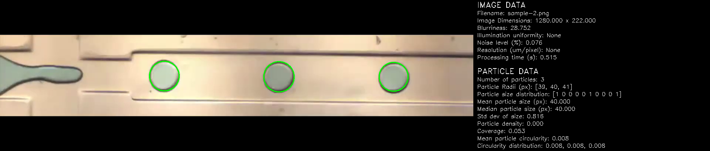
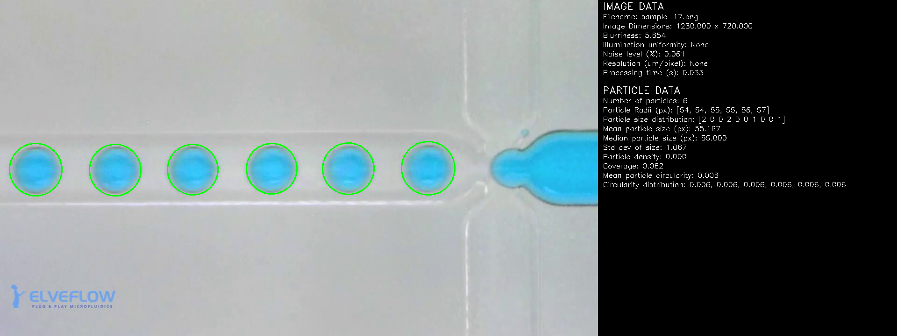

# Auto-Fluidics

[](LICENSE)
[](https://github.com/FinOrr/auto-fluidics)
[](https://github.com/FinOrr/auto-fluidics/issues)
[](https://github.com/FinOrr/auto-fluidics/pulls)

A lightweight, open-source toolkit for real-time microfluidics experiments. 
It uses computer vision to track particles and includes an API for controlling various types of pumps (pressure, syringe, peristaltic). 
Still early days; built in spare time.

## Features

- Real-time particle detection using computer vision
- Live video and image processing
- Simple API for controlling pumps
- Written in Python, with future plans for GPU/C++ support

## Why?

Microfluidics gear is expensive and often locked behind proprietary systems. 
This project is my attempt to build something more accessible, flexible, and hackable: no special hardware or vendor lock-in required.

---

## About

This repo is for anyone trying to do microfluidics without a massive budget or a PhD in lab automation.

### What it does:

- Tracks particles in microfluidic setups (videos, streams, etc.)
- Analyses motion and basic metrics in real time

That’s it. It’s meant to be useful without getting in your way.

---

## Project Status

Work in progress—actively developed when time allows. Right now it works with:

- Local image/video files
- Live streams (e.g., from an ESP32 camera)
- Basic CV pipelines (which are being tweaked constantly)

---

## Getting Started

### Requirements

- [`git`](https://git-scm.com/downloads)
- [`Python 3.10`](https://www.python.org/downloads/release/python-31012/)
  - [opencv-python](https://pypi.org/project/opencv-python/) `4.9.0.80`

### Clone

```bash
git clone --recursive git@github.com:finorr/auto-fluidics.git
````

---

### Example

```python
import cv2
import particle_detector as pdt

proc = pdt.ParticleImageProcessor()
win_name = 'Networked Stream'
cv2.namedWindow(win_name, cv2.WINDOW_NORMAL)

while cv2.waitKey(1) != 27:
    proc.process_stream(stream_ip='192.168.1.34')

    if proc.image['processed'] is not None:
        cv2.imshow(win_name, proc.image['processed'])
    else:
        cv2.imshow(win_name, proc.image['sample'])

cv2.destroyWindow(win_name)
```

### Output





---

### Build

Currently Python-only. When/if C++ support gets added (for GPU processing), this section will be updated.

---

### Test

Unit tests coming soon. For now, test by running and watching for obvious errors.

---

## Docs

Still being written. In the meantime, feel free to poke around or open an issue if anything’s unclear.

---

## Help

If you get stuck or have questions, feel free to open a [GitHub issue](https://github.com/FinOrr/auto-fluidics/issues) or contact me on [LinkedIn](https://www.linkedin.com/in/finorr/).

---

## License

MIT — see [LICENSE](LICENSE) for details.
