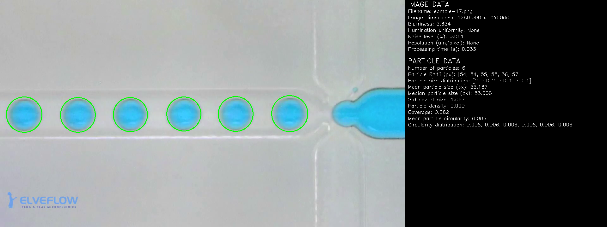
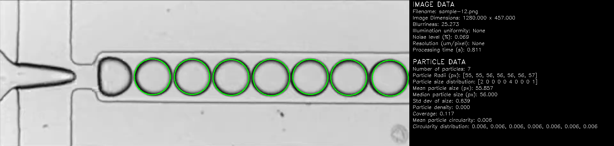
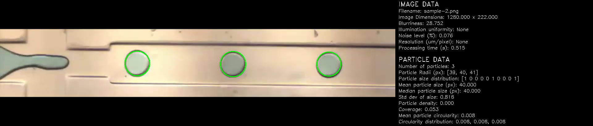

# Auto-Fluidics

[](LICENSE)
[](https://github.com/FinOrr/auto-fluidics)

Real-time droplet detection and microfluidic regime classification for automated microfluidics experiments.

## Quick Start

```bash
git clone git@github.com:FinOrr/auto-fluidics.git
cd auto-fluidics
pip install -r requirements.txt
streamlit run app.py
```

Open `http://localhost:8501` in your browser.

## Features

- Automatic droplet detection for grayscale and blue-dyed images
- Flow regime classification (DRIPPING, JETTING, CO_FLOW, NO_FLOW)
- ML-based classification using MobileNetV2
- Real-time metrics: count, size distribution, uniformity, aspect ratio
- Interactive Streamlit dashboard
- Batch processing mode
- Processing speed: 10-100ms per image

## Demo

Dashboard view:



Detection examples:

| Grayscale | Blue-Dyed |
|-----------|-----------|
|  |  |

## Usage

### Dashboard

Run the Streamlit app and select images from the `img/` folder:

```bash
streamlit run app.py
```

The dashboard provides single-image and batch analysis modes with automatic annotations and summary statistics.

### Python API

```python
from processing.particle_detector import ParticleImageProcessor
from perception.regime_detector import RegimeDetector

processor = ParticleImageProcessor(um_per_pixel=2.0)
detector = RegimeDetector()

processor.process_image('img/sample-10.png')
metrics = processor.particle_metrics

regime, confidence, indicators = detector.detect_regime(metrics)

print(f"Particles: {metrics['num_particles']}")
print(f"Regime: {regime.name} ({confidence:.0%})")
print(f"Size: {metrics['mean_particle_size']:.1f} px")
```

## Python Files

### Main Applications

- `app.py` - Streamlit dashboard for interactive droplet detection and analysis
- `validate_detection.py` - Batch validation script for testing detection on multiple images

### Machine Learning

- `train_regime_classifier.py` - Train the ML regime classifier on labeled data
- `label_training_data.py` - Interactive tool for labeling training images
- `check_ml_setup.py` - Verify TensorFlow installation and model availability

### Video Processing

- `batch_video_extract.py` - Extract frames from multiple videos for analysis
- `extract_training_from_video.py` - Extract and label frames from videos for training data

### Core Modules

#### processing/
- `particle_detector.py` - Core droplet detection engine using Hough Circle Transform
- `particle_streamer.py` - Real-time video stream processing
- `channel_detector.py` - Microfluidic channel detection and ROI extraction
- `demo_detector.py` - Simple demonstration script

#### perception/
- `regime_detector.py` - Rule-based flow regime classification (DRIPPING, JETTING, NO_FLOW, CO_FLOW)
- `ml_regime_classifier.py` - ML-based regime classification using MobileNetV2
- `encapsulation_detector.py` - Detection for encapsulated droplets

### Examples

- `examples/demo_enhanced_detection.py` - Enhanced detection demonstration

## How It Works

### Preprocessing
- Automatically detects grayscale vs blue-dyed images
- Blue channel extraction and inversion for blue-dyed samples
- Otsu thresholding for blue images, adaptive thresholding for grayscale
- Morphological operations for noise reduction

### Detection
- Hough Circle Transform with adaptive parameters
- Watermark filtering (excludes bottom 15% of image)
- Statistical outlier removal based on size distribution

### Regime Classification

Rule-based classifier uses multiple indicators:
- Particle count (< 3 particles indicates NO_FLOW)
- Aspect ratio (> 2.5 indicates JETTING)
- Size uniformity (CV > 0.3 indicates instability)
- Temporal tracking for stability assessment

ML classifier uses MobileNetV2:
- Pre-trained on ImageNet, fine-tuned on labeled microfluidic images
- Classifies full images or channel ROIs
- Four classes: NO_FLOW, DRIPPING, JETTING, CO_FLOW

## Configuration

Dashboard controls:
- Min particles threshold for DRIPPING detection (default: 3)
- Aspect ratio threshold for JETTING (default: 2.5)
- CV threshold for uniformity assessment (default: 0.3)
- Calibration: µm/pixel for physical measurements
- ML vs rule-based classifier selection

## Validation

Tested on 18 sample images:

| Metric | Result |
|--------|--------|
| Blue-dyed accuracy | 80-100% |
| Processing speed | 10-100 ms |
| Watermark filtering | 100% success |

Run validation:

```bash
python validate_detection.py
```

Annotated results are saved to `validation_output/`.

## Development

Add new sample images by placing PNG files in `img/`. They'll appear in the dashboard automatically.

## Contributing

Open an issue or submit a pull request. This is research software - contributions are welcome.

## Contact

- Issues: [GitHub Issues](https://github.com/FinOrr/auto-fluidics/issues)
- LinkedIn: [FinOrr](https://www.linkedin.com/in/finorr/)

## License

MIT License - see [LICENSE](LICENSE) for details
